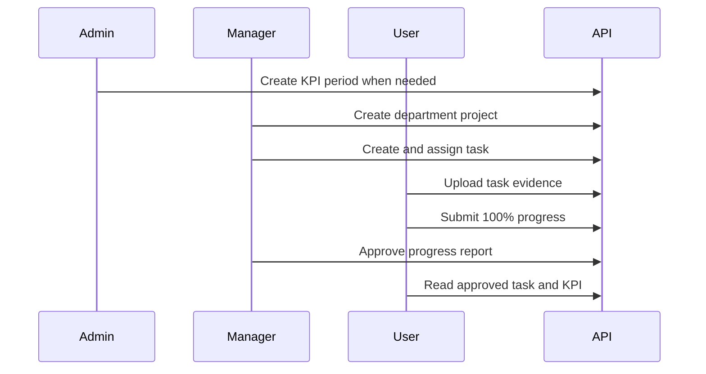

# Sample API Workflow

This flow exercises the same business path protected by the HTTP integration tests:



## Prerequisites

- Run the API in Development.
- Enable the optional demo seed.
- Use PowerShell 7 or later for the multipart `-Form` example.

The examples below target Docker at `http://localhost:8080`. For the local HTTPS profile, replace the base URL with `https://localhost:7231`.

## 1. Sign In

```powershell
$baseUrl = "http://localhost:8080"
$password = "Demo@123456"

function Get-AccessToken([string] $username) {
    $body = @{
        username = $username
        password = $password
    } | ConvertTo-Json

    Invoke-RestMethod `
        -Method Post `
        -Uri "$baseUrl/api/auth/login" `
        -ContentType "application/json" `
        -Body $body
}

$managerToken = Get-AccessToken "demo.manager"
$employeeToken = Get-AccessToken "demo.employee1"
$managerHeaders = @{ Authorization = "Bearer $managerToken" }
$employeeHeaders = @{ Authorization = "Bearer $employeeToken" }
$runId = Get-Date -Format "yyyyMMdd-HHmmss"
```

`POST /api/auth/login` returns the encoded access token as a string. Depending on HTTP content negotiation, clients can receive a plain-text body or a JSON string. This backend currently uses access tokens only; it does not expose a refresh-token endpoint.

## 2. Resolve The Employee

```powershell
$employees = Invoke-RestMethod `
    -Method Get `
    -Uri "$baseUrl/api/users/search?keyword=demo.employee1&role=User" `
    -Headers $managerHeaders

$employee = @($employees) | Select-Object -First 1
if ($null -eq $employee) { throw "Demo employee was not found." }
```

The Manager search is restricted to users visible inside the Manager's department.

## 3. Create A Project

```powershell
$project = Invoke-RestMethod `
    -Method Post `
    -Uri "$baseUrl/api/projects" `
    -Headers $managerHeaders `
    -ContentType "application/json" `
    -Body (@{
        name = "Backend API walkthrough $runId"
        description = "Project created by the documented API flow"
    } | ConvertTo-Json)
```

The API derives the project department from the authenticated Manager. Supplying another department id is rejected.

## 4. Create And Assign A Task

```powershell
$task = Invoke-RestMethod `
    -Method Post `
    -Uri "$baseUrl/api/tasks" `
    -Headers $managerHeaders `
    -ContentType "application/json" `
    -Body (@{
        title = "Verify the documented backend workflow"
        description = "Upload evidence, report completion, and request review"
        dueDate = (Get-Date).ToUniversalTime().AddDays(2).ToString("o")
        userIds = @($employee.id)
        unitIds = @()
        priority = "High"
        requiresReview = $true
        projectId = $project.id
    } | ConvertTo-Json -Depth 4)
```

New tasks always start as `NotStarted`. Clients cannot set task status directly.

## 5. Upload Evidence

```powershell
$evidencePath = Join-Path $PWD "evidence.txt"
Set-Content -LiteralPath $evidencePath -Value "API workflow evidence" -Encoding utf8

$upload = Invoke-RestMethod `
    -Method Post `
    -Uri "$baseUrl/api/Upload?taskId=$($task.id)" `
    -Headers $employeeHeaders `
    -Form @{ file = Get-Item -LiteralPath $evidencePath }
```

The file is attached to the task context. Uploading an unlinked file, reusing evidence for another task, or downloading without task access is rejected.

## 6. Submit Completion

```powershell
$progress = Invoke-RestMethod `
    -Method Post `
    -Uri "$baseUrl/api/progress" `
    -Headers $employeeHeaders `
    -ContentType "application/json" `
    -Body (@{
        taskId = $task.id
        percent = 100
        description = "Completed and ready for review"
        hoursSpent = 2
        fileId = $upload.id
    } | ConvertTo-Json)
```

The endpoint creates a new progress report and returns `201 Created` with the created `ProgressDto` in the response body.

Because this task requires review, the progress report and task become `Submitted`; they are not complete yet.

## 7. Approve The Report

```powershell
$review = Invoke-RestMethod `
    -Method Post `
    -Uri "$baseUrl/api/review" `
    -Headers $managerHeaders `
    -ContentType "application/json" `
    -Body (@{
        progressId = $progress.id
        approve = $true
        comment = "Evidence accepted"
    } | ConvertTo-Json)
```

Approval completes a single-assignee task. For a multi-assignee task, every required assignee must have an approved completion before the task becomes `Approved`.

## 8. Verify Task And KPI

```powershell
$approvedTask = Invoke-RestMethod `
    -Method Get `
    -Uri "$baseUrl/api/tasks/$($task.id)" `
    -Headers $employeeHeaders

$performance = Invoke-RestMethod `
    -Method Get `
    -Uri "$baseUrl/api/users/performance/$($employee.id)" `
    -Headers $employeeHeaders

$approvedTask | Select-Object id, title, status, actualHours, completedAt
$performance | Select-Object userId, score, totalTasks, completedOnTime, overdueTasks

Remove-Item -LiteralPath $evidencePath
```

Expected task status is `Approved`. KPI reads use the current explicit period created by the demo seed; read endpoints do not create missing KPI periods.

## Workflow Variants

- A task can omit `projectId`; Project is grouping metadata, not a second task workflow.
- A task with `requiresReview = false` can be approved by the progress workflow without a Manager review.
- Rejecting a submitted report marks that report `Rejected` and returns the unfinished task to `InProgress`.
- An archived project cannot accept unfinished work, and task/project departments must always match.
