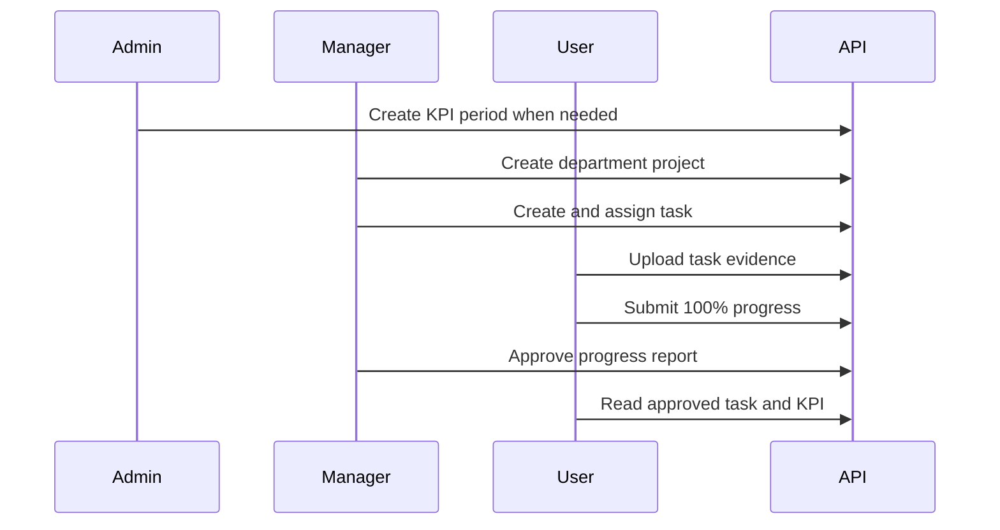

# Workflow API mẫu

Để chạy phiên bản một command có assertion của hướng dẫn này, dùng [`scripts/demo-workflow.ps1`](../scripts/demo-workflow.ps1). Các đoạn mẫu bên dưới vẫn hữu ích khi cần giải thích độc lập từng HTTP request.

Luồng này thực hiện cùng đường nghiệp vụ đang được HTTP integration test bảo vệ:



## Điều kiện cần

- Chạy API trong Development.
- Bật demo seed tùy chọn.
- Dùng PowerShell 7 trở lên cho ví dụ multipart `-Form` bên dưới. Automated demo script cũng hỗ trợ Windows PowerShell 5.1 bằng cách dùng `curl.exe` để upload.

Các ví dụ bên dưới gọi Docker tại `http://localhost:8080`. Với profile HTTPS cục bộ, thay base URL bằng `https://localhost:7231`.

## 1. Đăng nhập

```powershell
$baseUrl = "http://localhost:8080"
$password = "Demo@123456"

function Get-AccessToken([string] $username) {
    $body = @{
        username = $username
        password = $password
    } | ConvertTo-Json

    Invoke-RestMethod `
        -Method Post `
        -Uri "$baseUrl/api/auth/login" `
        -ContentType "application/json" `
        -Body $body
}

$managerToken = Get-AccessToken "demo.manager"
$employeeToken = Get-AccessToken "demo.employee1"
$managerHeaders = @{ Authorization = "Bearer $managerToken" }
$employeeHeaders = @{ Authorization = "Bearer $employeeToken" }
$runId = Get-Date -Format "yyyyMMdd-HHmmss"
```

`POST /api/auth/login` trả về access token đã mã hóa dưới dạng string. Tùy content negotiation của HTTP, client có thể nhận plain-text body hoặc JSON string. Backend hiện chỉ dùng access token và không cung cấp refresh-token endpoint.

## 2. Tìm nhân viên

```powershell
$employees = Invoke-RestMethod `
    -Method Get `
    -Uri "$baseUrl/api/users/search?keyword=demo.employee1&role=User" `
    -Headers $managerHeaders

$employee = @($employees) | Select-Object -First 1
if ($null -eq $employee) { throw "Demo employee was not found." }
```

Tìm kiếm của Manager chỉ trả về user mà Manager được phép xem trong phòng ban của mình.

## 3. Tạo Project

```powershell
$project = Invoke-RestMethod `
    -Method Post `
    -Uri "$baseUrl/api/projects" `
    -Headers $managerHeaders `
    -ContentType "application/json" `
    -Body (@{
        name = "Backend API walkthrough $runId"
        description = "Project created by the documented API flow"
    } | ConvertTo-Json)
```

API suy ra phòng ban của Project từ Manager đã xác thực. Gửi id của phòng ban khác sẽ bị từ chối.

## 4. Tạo và giao Task

```powershell
$task = Invoke-RestMethod `
    -Method Post `
    -Uri "$baseUrl/api/tasks" `
    -Headers $managerHeaders `
    -ContentType "application/json" `
    -Body (@{
        title = "Verify the documented backend workflow"
        description = "Upload evidence, report completion, and request review"
        dueDate = (Get-Date).ToUniversalTime().AddDays(2).ToString("o")
        userIds = @($employee.id)
        unitIds = @()
        priority = "High"
        requiresReview = $true
        projectId = $project.id
    } | ConvertTo-Json -Depth 4)
```

Task mới luôn bắt đầu ở `NotStarted`. Client không thể đặt trực tiếp trạng thái Task.

## 5. Tải evidence lên

```powershell
$evidencePath = Join-Path $PWD "evidence.txt"
Set-Content -LiteralPath $evidencePath -Value "API workflow evidence" -Encoding utf8

$upload = Invoke-RestMethod `
    -Method Post `
    -Uri "$baseUrl/api/Upload?taskId=$($task.id)" `
    -Headers $employeeHeaders `
    -Form @{ file = Get-Item -LiteralPath $evidencePath }
```

File được gắn vào ngữ cảnh Task. Hệ thống từ chối upload file không liên kết, tái sử dụng evidence cho Task khác hoặc download khi không có quyền truy cập Task.

## 6. Gửi báo cáo hoàn thành

```powershell
$progress = Invoke-RestMethod `
    -Method Post `
    -Uri "$baseUrl/api/progress" `
    -Headers $employeeHeaders `
    -ContentType "application/json" `
    -Body (@{
        taskId = $task.id
        percent = 100
        description = "Completed and ready for review"
        hoursSpent = 2
        fileId = $upload.id
    } | ConvertTo-Json)
```

Endpoint tạo một báo cáo Progress mới và trả về `201 Created` cùng `ProgressDto` vừa tạo trong response body.

Vì Task này yêu cầu review, Progress và Task chuyển thành `Submitted`; chúng chưa hoàn thành.

## 7. Duyệt báo cáo

```powershell
$review = Invoke-RestMethod `
    -Method Post `
    -Uri "$baseUrl/api/review" `
    -Headers $managerHeaders `
    -ContentType "application/json" `
    -Body (@{
        progressId = $progress.id
        approve = $true
        comment = "Evidence accepted"
    } | ConvertTo-Json)
```

Việc duyệt sẽ hoàn thành Task có một assignee. Với Task có nhiều assignee, mọi assignee bắt buộc phải có lần hoàn thành được duyệt trước khi Task chuyển thành `Approved`.

## 8. Xác minh Task và KPI

```powershell
$approvedTask = Invoke-RestMethod `
    -Method Get `
    -Uri "$baseUrl/api/tasks/$($task.id)" `
    -Headers $employeeHeaders

$performance = Invoke-RestMethod `
    -Method Get `
    -Uri "$baseUrl/api/users/performance/$($employee.id)" `
    -Headers $employeeHeaders

$approvedTask | Select-Object id, title, status, actualHours, completedAt
$performance | Select-Object userId, score, totalTasks, completedOnTime, overdueTasks

Remove-Item -LiteralPath $evidencePath
```

Trạng thái Task mong đợi là `Approved`. Luồng đọc KPI dùng kỳ hiện tại đã được demo seed tạo rõ ràng; read endpoint không tự tạo kỳ KPI còn thiếu.

## Biến thể workflow

- Task có thể bỏ `projectId`; Project là metadata gom nhóm, không phải workflow Task thứ hai.
- Task có `requiresReview = false` có thể được workflow Progress duyệt mà không cần Manager review.
- Từ chối báo cáo đã gửi sẽ đặt Progress đó thành `Rejected` và đưa Task chưa hoàn thành về `InProgress`.
- Project đã lưu trữ không thể nhận công việc chưa hoàn thành, và phòng ban của Task/Project phải luôn trùng nhau.
