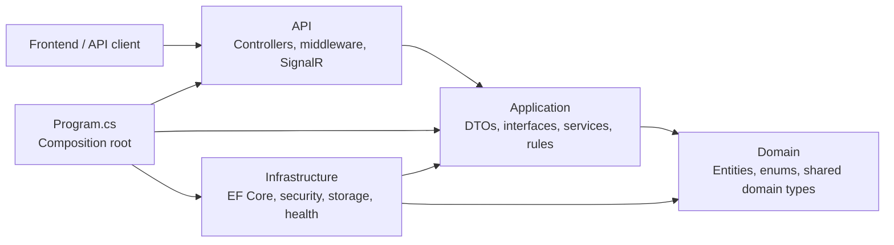
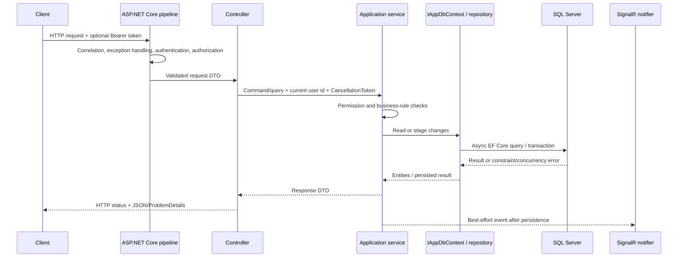
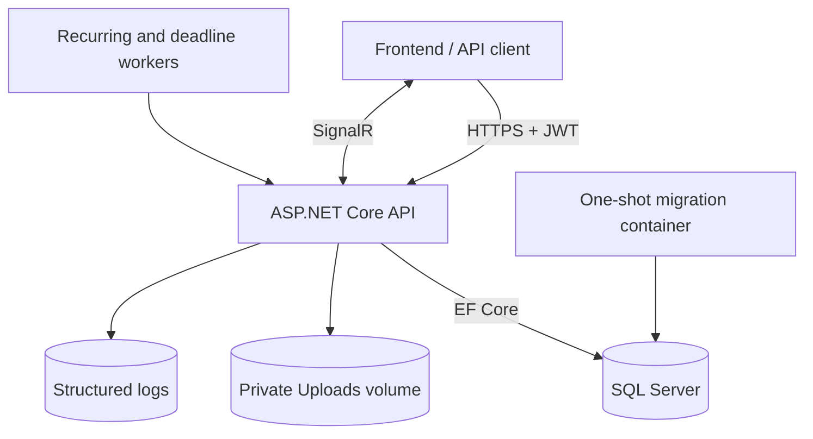

# Kiến trúc

## Định vị kiến trúc

WorkManagementSystem là một **layered modular monolith**. Code production được biên dịch thành một project ASP.NET Core Web API, còn automated test nằm trong project xUnit riêng.

Các folder thể hiện ranh giới logic bên trong runtime project. Chúng không phải service triển khai độc lập hoặc class-library assembly riêng. Vì vậy codebase không tuyên bố là microservices, full Clean Architecture hoặc một implementation DDD hoàn chỉnh.

Cấu trúc này là chủ đích cho phạm vi hiện tại: một API có thể triển khai, một database SQL Server, ranh giới sở hữu rõ ràng và đủ phân tách để test quy tắc nghiệp vụ mà không tăng độ phức tạp triển khai.

## Hướng dependency



Các quy tắc dependency hiện được test bảo vệ:

- Type trong `Application` không được phụ thuộc vào type trong `API` hoặc `Infrastructure`.
- Controller phải gọi application service thay vì inject `AppDbContext`, EF `DbContext` hoặc repository.
- Infrastructure triển khai port hướng về Application như `IAppDbContext`, `IGenericRepository<T>`, password hashing, transaction và storage cleanup.
- `Program.cs` là composition root và được phép biết mọi layer để đăng ký concrete implementation.

Application layer dùng abstraction truy vấn EF Core qua `IAppDbContext`. Đây là persistence boundary thực dụng, không phải persistence ignorance. Muốn chuyển từng layer thành assembly riêng cần thay interface đó bằng query/command port hẹp hơn trước.

## Trách nhiệm của folder

| Path | Trách nhiệm | Không được chứa |
| --- | --- | --- |
| `API/Controllers` | HTTP routing, status code, ngữ cảnh User đã xác thực | Business workflow hoặc truy cập dữ liệu trực tiếp |
| `API/Middlewares` | Correlation, lỗi, security header, logging context | Quyết định domain |
| `API/Hubs` | Kết nối SignalR đã authorization và notification trong process | Thay đổi persistence |
| `Application/DTOs` | Hợp đồng request/response công khai | EF entity được trả trực tiếp qua API |
| `Application/Interfaces` | Port do controller và application service sử dụng | Concrete implementation của infrastructure |
| `Application/Services` | Phạm vi authorization, quy tắc nghiệp vụ, điều phối workflow | Xử lý response riêng của HTTP |
| `Domain` | Trạng thái nghiệp vụ bền vững và enum được hỗ trợ | Dependency tới API hoặc infrastructure |
| `Infrastructure/Data` | EF Core context, transaction, model configuration, seed data | Mối quan tâm của controller |
| `Infrastructure/Security` | Implementation BCrypt | Quyết định workflow đăng nhập |
| `Infrastructure/Storage` | Đối soát file vật lý | Authorization file công khai |
| `Infrastructure/Scheduling` | Hosted-worker loop mỏng resolve application scheduler có scope | Quy tắc nghiệp vụ hoặc scheduling state trong memory |
| `Migrations` | Lịch sử schema SQL Server có version | Seed dữ liệu runtime |

## Luồng request và dữ liệu



Đặc điểm quan trọng:

- Luồng đọc dùng `AsNoTracking` khi không cần change tracking.
- Thao tác nhiều bước dùng `ITransactionManager`; luồng điều chuyển nhân sự nhạy cảm và đảm bảo uniqueness dùng serializable transaction khi cần.
- `rowversion` bảo vệ record có thể sửa bằng optimistic concurrency.
- Unique constraint, foreign key và check constraint trong database là ranh giới toàn vẹn cuối cùng.
- Cancellation của request được truyền từ controller vào service và EF Core call.
- Realtime delivery là best effort. Lỗi SignalR được log và không rollback thay đổi nghiệp vụ đã thành công.

Activity timeline của Task là read model trên các bảng workflow hiện có. Nó thực hiện projection có giới hạn theo từng nguồn event, ghép bằng cursor ordering xác định và batch-load actor snapshot. Nó không nhân đôi trạng thái ghi trong bảng activity chung và không bao giờ làm lộ JSON thô của `AuditLog`.

Thay đổi trạng thái Task và Progress được tập trung trong `TaskWorkflowPolicy` riêng cho domain và `TaskWorkflowService`. Policy sở hữu ma trận transition rõ ràng; service áp dụng domain method, ngữ cảnh completion/dependency, approved hours và transition history. Kiểm tra phạm vi người báo cáo và Manager vẫn nằm trong command service tương ứng, nên chỉ có role không bao giờ đủ quyền chuyển trạng thái tài nguyên. Hệ thống không có generic status-mutation endpoint hoặc generic workflow engine.

## Topology runtime



Recurring-task và deadline-reminder worker chạy bên trong API process, nhưng SQL Server là nguồn dữ liệu chuẩn. Restart không làm mất schedule hoặc reminder đang chờ. Compose stack chạy SQL Server, một migration image one-shot và một API instance. Production topology, kết thúc TLS, backup, tổng hợp log và lưu secret là trách nhiệm của nền tảng triển khai.

## Kiểm soát xuyên suốt

- JWT access token chứa `TokenVersion`; thay đổi tài khoản và bảo mật thu hồi token cũ.
- Role attribute tạo ranh giới API bên ngoài, còn service cưỡng chế phạm vi phòng ban, assignment và dữ liệu lịch sử.
- Lỗi dùng hợp đồng tương thích ProblemDetails thống nhất với correlation identifier.
- Endpoint authentication và upload có fixed-window rate limit.
- Upload là riêng tư và cần authorization theo Task để download.
- `/health/live` kiểm tra process; `/health/ready` kiểm tra SQL Server và khả năng ghi upload storage.
- Serilog ghi correlation và ngữ cảnh User đã xác thực theo structured data mà không chủ ý log credential hoặc token.

## Xác minh kiến trúc

`WorkManagementSystem.Tests/ArchitectureDependencyTests.cs` bảo vệ các quy tắc dependency. API contract test cũng xác minh route rõ ràng, allowlist public endpoint và authorization workflow Admin/Manager.

Chạy test liên quan bằng:

```powershell
dotnet test .\WorkManagementSystem.Tests\WorkManagementSystem.Tests.csproj `
  --filter "FullyQualifiedName~ArchitectureDependencyTests|FullyQualifiedName~ApiAuthorizationContractTests"
```
