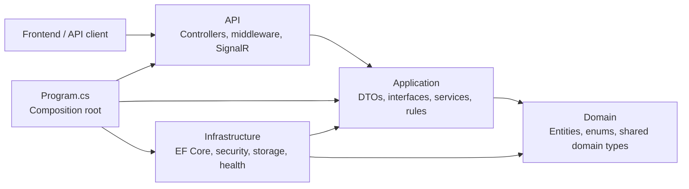
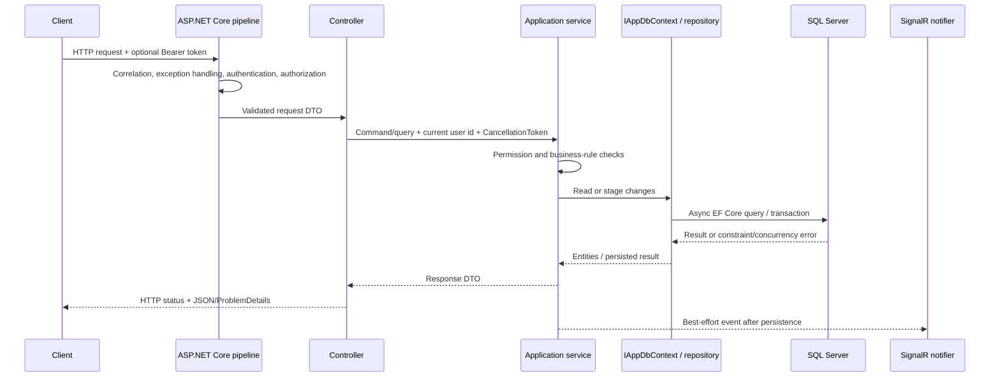
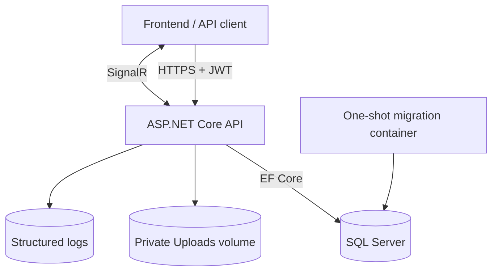

# Architecture

## Architectural Position

WorkManagementSystem is a **layered modular monolith**. The production code is compiled into one ASP.NET Core Web API project, while automated tests live in a separate xUnit project.

The folders represent logical boundaries inside the runtime project. They are not independent deployable services or separate class-library assemblies. The codebase therefore does not claim to be microservices, full Clean Architecture, or a complete DDD implementation.

This structure is intentional for the current scope: one deployable API, one SQL Server database, clear ownership boundaries, and enough separation to test business rules without adding deployment complexity.

## Dependency Direction



The dependency rules currently enforced by tests are:

- `Application` types must not depend on `API` or `Infrastructure` types.
- Controllers must call application services instead of injecting `AppDbContext`, EF `DbContext`, or repositories.
- Infrastructure implements application-facing ports such as `IAppDbContext`, `IGenericRepository<T>`, password hashing, transactions, and storage cleanup.
- `Program.cs` is the composition root and is allowed to know every layer so it can register concrete implementations.

The application layer uses EF Core query abstractions through `IAppDbContext`. This is a pragmatic persistence boundary, not persistence ignorance. Moving every layer into a separate assembly would require replacing that interface with narrower query/command ports first.

## Folder Ownership

| Path | Responsibility | Must not contain |
| --- | --- | --- |
| `API/Controllers` | HTTP routing, status codes, authenticated-user context | Business workflow or direct data access |
| `API/Middlewares` | Correlation, errors, security headers, logging context | Domain decisions |
| `API/Hubs` | Authorized SignalR connections and in-process notifications | Persistence mutations |
| `Application/DTOs` | Public request and response contracts | EF entities exposed as API responses |
| `Application/Interfaces` | Ports used by controllers and application services | Concrete infrastructure implementations |
| `Application/Services` | Authorization scope, business rules, workflow orchestration | HTTP-specific response handling |
| `Domain` | Persistent business state and supported enum values | API or infrastructure dependencies |
| `Infrastructure/Data` | EF Core context, transactions, model configuration, seed data | Controller concerns |
| `Infrastructure/Security` | BCrypt implementation | Login workflow decisions |
| `Infrastructure/Storage` | Physical-file reconciliation | Public file authorization |
| `Migrations` | Versioned SQL Server schema history | Runtime data seeding |

## Request And Data Flow



Important characteristics:

- Read paths use `AsNoTracking` where change tracking is unnecessary.
- Multi-step mutations use `ITransactionManager`; sensitive staff movement and uniqueness flows use serializable transactions where required.
- `rowversion` protects mutable records that support optimistic concurrency.
- Database unique, foreign-key, and check constraints remain the final integrity boundary.
- Request cancellation is propagated from controllers into services and EF Core calls.
- Realtime delivery is best effort. A SignalR failure is logged and does not undo an already successful business mutation.

## Runtime Topology



The Compose stack runs SQL Server, a one-shot migration image, and one API instance. Production topology, TLS termination, backups, log aggregation, and secret storage remain deployment-platform responsibilities.

## Cross-Cutting Controls

- JWT access tokens include `TokenVersion`; account and security changes revoke older tokens.
- Role attributes provide the outer API boundary, while services enforce department, assignment, and historical-data scope.
- Errors use a consistent ProblemDetails-compatible contract with a correlation identifier.
- Authentication and upload endpoints have fixed-window rate limits.
- Uploads are private and require task-aware authorization for download.
- `/health/live` checks the process; `/health/ready` checks SQL Server and upload-storage writability.
- Serilog records structured correlation and authenticated user context without intentionally logging credentials or tokens.

## Architecture Verification

`WorkManagementSystem.Tests/ArchitectureDependencyTests.cs` guards the dependency rules. API contract tests also verify explicit routes, public endpoint allowlisting, and Admin/Manager workflow authorization.

Run the relevant tests with:

```powershell
dotnet test .\WorkManagementSystem.Tests\WorkManagementSystem.Tests.csproj `
  --filter "FullyQualifiedName~ArchitectureDependencyTests|FullyQualifiedName~ApiAuthorizationContractTests"
```
