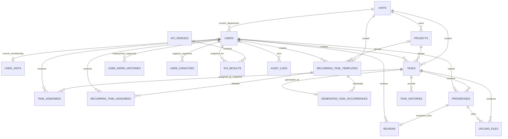

# Database Overview

This document summarizes the main data model for the Work Management System backend.

## Core Tables

- `Users`: application accounts and staff profile data. A user can be `Admin`, `Manager`, or `User`; `TokenVersion` invalidates stale JWT sessions after security-sensitive account changes.
- `Units`: departments/teams managed by managers.
- `UserUnits`: the current one-to-one membership record between a user and a department.
- `Projects`: work scopes owned by exactly one department. A project groups related tasks.
- `Tasks`: concrete work items assigned by a manager and scoped to exactly one department.
- `TaskAssignees`: user assignment snapshot for a task. Legacy rows may target a department, but new department assignments are expanded into user rows at creation time.
- `RecurringTaskTemplates`: durable daily, weekly, or monthly task definitions with persisted next-run state and optimistic concurrency.
- `RecurringTaskAssignees`: optional explicit default users for a recurring template; no rows means resolve the current department staff at generation time.
- `GeneratedTaskOccurrences`: immutable link from one scheduled template occurrence to exactly one generated task.
- `ReminderPolicies`: Global, Unit, or Project deadline policy with fixed due-soon and escalation milestones.
- `ScheduledNotifications`: durable task-level reminder milestones, retry state, suppression reason, and sent timestamp.
- `Progresses`: progress reports submitted by users for assigned tasks.
- `Reviews`: manager review result for a submitted progress report.
- `UploadFiles`: evidence/reference metadata attached to tasks or progress reports; `StorageKey` is relative to the private upload root.
- `Notifications`: user notifications.
- `TaskComments`, `CommentReactions`, `CommentSeens`: task discussion and read/reaction metadata.
- `SubTasks`: checklist items inside a task.
- `KpiPeriods`: KPI evaluation windows, usually monthly.
- `KpiResults`: locked KPI calculation result, formula version, identity snapshot, and raw metrics per user and period.
- `UserWorkHistories`: role/unit history used to calculate KPI correctly when staff move departments or roles.
- `UserCapacities`: effective-dated weekly capacity history used for workload planning.
- `TaskHistories`: field-level task changes, task/progress status transitions, reminders, creation, and soft deletion. Transition rows can store a bounded `Reason` and nullable `RelatedEntityId` for the triggering progress/dependency resource.
- `AuditLogs`: append-only administrative audit events for accounts, departments, projects, and KPI periods.

## Core Relationship Diagram

The diagram focuses on workflow and KPI relationships. Notification and task-discussion tables are omitted here to keep the main data path readable.



## Important Relationships

- `Users.UnitId -> Units.Id`: current department membership.
- `Tasks.CreatedBy -> Users.Id`: manager who created the task.
- `Tasks.UnitId -> Units.Id`: department scope of the task.
- `(Tasks.ProjectId, Tasks.UnitId) -> (Projects.Id, Projects.UnitId)`: optional project grouping with enforced department consistency.
- `TaskAssignees.TaskId -> Tasks.Id`.
- `TaskAssignees.UserId -> Users.Id` for normal assignment snapshots.
- `TaskAssignees.UnitId -> Units.Id` for legacy department-scope rows.
- `RecurringTaskTemplates.UnitId -> Units.Id` and `(ProjectId, UnitId) -> (Projects.Id, UnitId)` enforce department scope.
- `RecurringTaskAssignees.TemplateId -> RecurringTaskTemplates.Id` and `UserId -> Users.Id`.
- `GeneratedTaskOccurrences.TemplateId -> RecurringTaskTemplates.Id` and `TaskId -> Tasks.Id`.
- `ReminderPolicies.UnitId -> Units.Id` and `ProjectId -> Projects.Id`; a scope-shape check permits only the foreign key matching `ScopeType`.
- `ScheduledNotifications.TaskId -> Tasks.Id`.
- `Progresses.TaskId -> Tasks.Id`.
- `Progresses.UserId -> Users.Id`.
- `Reviews.ProgressId -> Progresses.Id`.
- `Reviews.ReviewerId -> Users.Id`.
- `KpiResults.PeriodId -> KpiPeriods.Id`.
- `KpiResults.UserId -> Users.Id`.
- `UserWorkHistories.UserId -> Users.Id`.
- `UserCapacities.UserId -> Users.Id` and `UserCapacities.ChangedByUserId -> Users.Id`.
- `TaskHistories.TaskId -> Tasks.Id`.
- `TaskHistories.ChangedBy -> Users.Id`.
- `AuditLogs.ActorUserId -> Users.Id` when an authenticated actor exists.

## Constraints And Indexes

- `Users.Username` is unique.
- `Users.EmployeeCode` is unique.
- `Users.TokenVersion` is required and defaults to `0` for existing and newly created accounts.
- `Units.Name` is unique.
- `UserUnits.UserId` is unique, so one user has at most one current membership row.
- `Projects` are unique by `(UnitId, Name)`.
- `Projects.UnitId` and `Tasks.UnitId` are required.
- `Projects` expose alternate key `(Id, UnitId)` for the composite task relationship.
- A task linked to a project cannot carry a different `UnitId`.
- `TaskAssignees` are unique by `(TaskId, UserId)` and `(TaskId, UnitId)`.
- `TaskAssignees` must target exactly one side: user or unit.
- New department assignments should be stored as direct user rows so KPI remains stable after staff transfers.
- `RecurringTaskTemplates` constrain recurrence type, interval, schedule shape, and optional positive planning effort.
- `RecurringTaskTemplates` use SQL Server `rowversion` and an `(IsActive, NextRunAtUtc)` due-scan index.
- `RecurringTaskAssignees` are unique by `(TemplateId, UserId)`.
- `GeneratedTaskOccurrences` use primary key `(TemplateId, ScheduledForUtc)` and a unique `TaskId`, preventing duplicate or multiply-linked generated tasks.
- `ReminderPolicies` allow one Global policy, one policy per Unit, and one policy per Project through filtered unique indexes.
- `ReminderPolicies` constrain scope shape and both hour thresholds; mutable policies use SQL Server `rowversion`.
- `ScheduledNotifications` are unique by both `EventKey` and `(TaskId, Type)`, constrain enum/retry ranges, and use `rowversion` for competing delivery workers.
- The `(Status, ScheduledForUtc, RetryCount)` index supports bounded pending/retry scans without loading notification history.
- `Progresses.Percent` must be from `0` to `100`.
- `Progresses.HoursSpent` must be non-negative.
- `Tasks.ActualHours` must be non-negative.
- `Tasks.PlannedEffortHours` is nullable for legacy/unplanned tasks and must be positive when provided.
- `Tasks.Status` is limited to `NotStarted`, `InProgress`, `Submitted`, and `Approved`.
- `Reviews.ProgressId` is unique, so each progress report has at most one review result.
- `UploadFiles.FileName` and `UploadFiles.StorageKey` are required and bounded; server absolute paths are not persisted.
- `KpiPeriods` are unique by `(StartDate, EndDate)`.
- `KpiPeriods.EndDate` must be greater than `StartDate`.
- `KpiResults` are unique by `(PeriodId, UserId)`.
- `KpiResults` store bounded, required `FullNameSnapshot`, `EmployeeCodeSnapshot`, and `UnitNameSnapshot` values for immutable locked output.
- `KpiResults.FormulaVersion` identifies the deterministic scoring rules used to create the snapshot.
- `CompletedTasks`, `ProgressReportCount`, `PlannedEffortHours`, and `ActualHours` preserve the raw values needed to derive management rates without reading mutable source rows.
- `UserWorkHistories.UserId` has a filtered unique index for rows where `EffectiveTo IS NULL`, so one user has at most one open work-history segment.
- `UserCapacities.UserId` has a filtered unique index for rows where `EffectiveTo IS NULL`, so one user has at most one open capacity segment.
- `UserCapacities.WeeklyCapacityHours` must be positive and `EffectiveTo` must be later than `EffectiveFrom`.
- `TaskHistories`, `Progresses`, `TaskComments`, and `UploadFiles` have task/time/id indexes for deterministic timeline scans.
- `TaskHistories.Reason` is limited to 1000 characters. `RelatedEntityId` is intentionally not a foreign key because it identifies different workflow resource types while the owning task foreign key remains authoritative.
- `ScheduledNotifications` has `(TaskId, SentAtUtc, Id)` in addition to its worker indexes so sent reminder activity can be read without scanning unrelated tasks.
- `AuditLogs` are indexed by `(EntityType, EntityId, OccurredAt)` and `(ActorUserId, OccurredAt)`.
- `KpiResults` score/count fields must be non-negative.
- Completed, overdue, and rejected counters cannot exceed their corresponding total counters.
- `KpiResults.EffectiveTo` must be greater than or equal to `EffectiveFrom`.
- Critical business relationships use `NoAction` delete behavior to avoid accidental cascade loss of task, KPI, and work-history records.
- Soft-deleting a user does not delete `TaskAssignees`, `Progresses`, `Reviews`, `UserWorkHistories`, or `KpiResults`; current `UserUnits` membership is removed instead.

## Migration Notes

- Runtime schema changes must not be executed from `Program.cs`.
- Schema changes should be added as EF Core migrations.
- Demo seed data does not change schema and is controlled separately by `DemoSeed:Enabled`.
- `JoinedUnitAt` is ensured by migration because it is needed for KPI period calculation after unit/role changes.
- The migration chain conditionally creates nullable task `StartDate` and `DueDate` columns before enforcing their date-range constraint, so a database can be built from empty schema as well as upgraded from older development databases.
- The old `EstimatedHours` field was removed because KPI must not depend on an unverifiable employee time estimate.
- `PlannedEffortHours` is a separate, Manager-owned resource-allocation value. It supports workload forecasting and non-scoring estimation insight but never contributes to the KPI score.
- `ActualHours` remains derived only from approved progress reports.
- Recurring schedule state and generated occurrences are durable database records; worker memory is never the scheduling source of truth.
- Deadline reminder state, retry count, and sent/suppressed outcome are durable database records. The initial migration seeds one active Global `24h/24h` policy.
- The task timeline is a read model over existing workflow tables; `AddTaskTimelineReadIndexes` adds read indexes only and does not duplicate events into a new table.
- Unused prototype artifacts `Boards`, `BoardColumns`, `TaskActivities`, `TaskReminders`, `Tasks.ParentTaskId`, and `Tasks.OrderIndex` were removed. Project status summaries are derived from `Tasks.ProjectId` and `Tasks.Status`.

## Migration Safety Procedure

Use this order for every schema-affecting phase:

1. Confirm the application model matches the latest migration:

   ```powershell
   dotnet ef migrations has-pending-model-changes --no-build
   ```

2. Create a SQL Server `COPY_ONLY` backup with `CHECKSUM`, then run `RESTORE VERIFYONLY` against that backup.
3. Generate and inspect an idempotent migration script:

   ```powershell
   dotnet ef migrations script --idempotent --output artifacts/migrations.sql
   ```

4. Apply the migration to a disposable or test database first.
5. Run the complete test suite and the affected API workflow against SQL Server.
6. Apply the reviewed script to the target database and verify `__EFMigrationsHistory`.

Rollback policy:

- Prefer a corrective forward migration after a release has reached a shared environment.
- Restore the verified pre-change backup if a failed migration leaves data or schema in an unsafe state.
- Do not use ad hoc SQL edits or automatic destructive downgrade commands.
- Keep data backfills idempotent and separate irreversible cleanup from the migration that introduces new columns or constraints.

## Business Rules Reflected In The Database

- Managers can create and assign tasks only inside their department.
- Users can report progress only for tasks they can access.
- Completion can require manager review depending on the task setting.
- KPI is period-based and should use `UserWorkHistories` to keep old department/role context stable.
