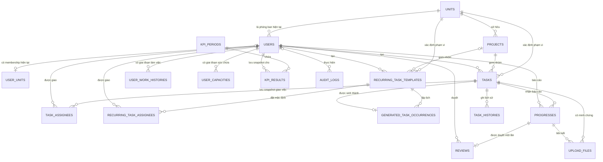

# Tổng quan database

Tài liệu này tóm tắt mô hình dữ liệu chính của backend Work Management System.

## Các bảng lõi

- `Users`: tài khoản ứng dụng và dữ liệu hồ sơ nhân sự. User có thể là `Admin`, `Manager` hoặc `User`; `TokenVersion` vô hiệu hóa JWT session cũ sau thay đổi nhạy cảm về bảo mật của tài khoản.
- `Units`: phòng ban/nhóm do Manager quản lý.
- `UserUnits`: bản ghi membership one-to-one hiện tại giữa User và phòng ban.
- `Projects`: phạm vi công việc thuộc đúng một phòng ban. Project gom nhóm các Task liên quan.
- `Tasks`: công việc cụ thể do Manager giao và thuộc đúng một phòng ban.
- `TaskAssignees`: snapshot User được giao tại thời điểm tạo Task. Dữ liệu cũ có thể trỏ đến phòng ban, nhưng assignment phòng ban mới được mở rộng thành từng hàng User khi tạo.
- `RecurringTaskTemplates`: định nghĩa Task lặp hằng ngày, tuần hoặc tháng, lưu trạng thái lần chạy tiếp theo và dùng optimistic concurrency.
- `RecurringTaskAssignees`: User mặc định tùy chọn của recurring template; không có hàng nào nghĩa là lấy nhân sự hiện tại của phòng ban khi sinh Task.
- `GeneratedTaskOccurrences`: liên kết bất biến từ một lần xuất hiện theo lịch của template đến đúng một Task đã sinh.
- `ReminderPolicies`: policy deadline phạm vi Global, Unit hoặc Project với milestone sắp đến hạn và escalation cố định.
- `ScheduledNotifications`: milestone reminder theo Task, trạng thái retry, lý do suppress và thời điểm đã gửi được lưu bền vững.
- `Progresses`: báo cáo tiến độ do User được giao gửi cho Task.
- `Reviews`: kết quả review của Manager cho một báo cáo Progress đã gửi.
- `UploadFiles`: metadata evidence/tài liệu tham khảo gắn với Task hoặc Progress; `StorageKey` tương đối với private upload root.
- `Notifications`: thông báo của User.
- `TaskComments`, `CommentReactions`, `CommentSeens`: thảo luận Task cùng metadata đã đọc/reaction.
- `SubTasks`: mục checklist bên trong Task.
- `KpiPeriods`: khoảng đánh giá KPI, thường theo tháng.
- `KpiResults`: kết quả tính KPI đã khóa, formula version, identity snapshot và raw metric theo User và kỳ.
- `UserWorkHistories`: lịch sử role/phòng ban dùng để tính KPI đúng khi nhân sự chuyển phòng hoặc đổi role.
- `UserCapacities`: lịch sử weekly capacity có hiệu lực theo thời gian dùng cho workload planning.
- `TaskHistories`: thay đổi từng field của Task, chuyển trạng thái Task/Progress, reminder, tạo và soft delete. Hàng transition có thể lưu `Reason` giới hạn độ dài và `RelatedEntityId` nullable của tài nguyên Progress/dependency gây ra thay đổi.
- `AuditLogs`: administrative audit event append-only cho tài khoản, phòng ban, Project và kỳ KPI.

## Sơ đồ quan hệ lõi

Sơ đồ tập trung vào quan hệ workflow và KPI. Bảng Notification và thảo luận Task được lược khỏi đây để luồng dữ liệu chính dễ đọc.



## Các quan hệ quan trọng

- `Users.UnitId -> Units.Id`: membership phòng ban hiện tại.
- `Tasks.CreatedBy -> Users.Id`: Manager tạo Task.
- `Tasks.UnitId -> Units.Id`: phạm vi phòng ban của Task.
- `(Tasks.ProjectId, Tasks.UnitId) -> (Projects.Id, Projects.UnitId)`: quan hệ gom nhóm Project tùy chọn có cưỡng chế đồng nhất phòng ban.
- `TaskAssignees.TaskId -> Tasks.Id`.
- `TaskAssignees.UserId -> Users.Id` cho assignment snapshot thông thường.
- `TaskAssignees.UnitId -> Units.Id` cho hàng phạm vi phòng ban cũ.
- `RecurringTaskTemplates.UnitId -> Units.Id` và `(ProjectId, UnitId) -> (Projects.Id, UnitId)` cưỡng chế phạm vi phòng ban.
- `RecurringTaskAssignees.TemplateId -> RecurringTaskTemplates.Id` và `UserId -> Users.Id`.
- `GeneratedTaskOccurrences.TemplateId -> RecurringTaskTemplates.Id` và `TaskId -> Tasks.Id`.
- `ReminderPolicies.UnitId -> Units.Id` và `ProjectId -> Projects.Id`; check constraint hình dạng scope chỉ cho phép foreign key khớp với `ScopeType`.
- `ScheduledNotifications.TaskId -> Tasks.Id`.
- `Progresses.TaskId -> Tasks.Id`.
- `Progresses.UserId -> Users.Id`.
- `Reviews.ProgressId -> Progresses.Id`.
- `Reviews.ReviewerId -> Users.Id`.
- `KpiResults.PeriodId -> KpiPeriods.Id`.
- `KpiResults.UserId -> Users.Id`.
- `UserWorkHistories.UserId -> Users.Id`.
- `UserCapacities.UserId -> Users.Id` và `UserCapacities.ChangedByUserId -> Users.Id`.
- `TaskHistories.TaskId -> Tasks.Id`.
- `TaskHistories.ChangedBy -> Users.Id`.
- `AuditLogs.ActorUserId -> Users.Id` khi có actor đã xác thực.

## Constraint và index

- `Users.Username` là duy nhất.
- `Users.EmployeeCode` là duy nhất.
- `Users.TokenVersion` là bắt buộc và mặc định `0` cho tài khoản hiện có lẫn mới tạo.
- `Units.Name` là duy nhất.
- `UserUnits.UserId` là duy nhất, nên mỗi User có tối đa một membership hiện tại.
- `Projects` duy nhất theo `(UnitId, Name)`.
- `Projects.UnitId` và `Tasks.UnitId` là bắt buộc.
- `Projects` cung cấp alternate key `(Id, UnitId)` cho quan hệ Task composite.
- Task liên kết Project không thể có `UnitId` khác.
- `TaskAssignees` duy nhất theo `(TaskId, UserId)` và `(TaskId, UnitId)`.
- `TaskAssignees` phải trỏ đến đúng một phía: User hoặc Unit.
- Assignment phòng ban mới phải được lưu thành từng hàng User trực tiếp để KPI ổn định sau khi nhân sự điều chuyển.
- `RecurringTaskTemplates` giới hạn recurrence type, interval, hình dạng schedule và planning effort dương tùy chọn.
- `RecurringTaskTemplates` dùng SQL Server `rowversion` và index due-scan `(IsActive, NextRunAtUtc)`.
- `RecurringTaskAssignees` duy nhất theo `(TemplateId, UserId)`.
- `GeneratedTaskOccurrences` dùng primary key `(TemplateId, ScheduledForUtc)` và `TaskId` duy nhất, ngăn Task sinh trùng hoặc liên kết nhiều lần.
- `ReminderPolicies` cho phép một policy Global, một policy mỗi Unit và một policy mỗi Project bằng filtered unique index.
- `ReminderPolicies` giới hạn hình dạng scope và hai ngưỡng giờ; policy có thể sửa dùng SQL Server `rowversion`.
- `ScheduledNotifications` duy nhất theo cả `EventKey` và `(TaskId, Type)`, giới hạn enum/retry và dùng `rowversion` cho các delivery worker cạnh tranh.
- Index `(Status, ScheduledForUtc, RetryCount)` hỗ trợ scan pending/retry có giới hạn mà không load lịch sử notification.
- `Progresses.Percent` phải từ `0` đến `100`.
- `Progresses.HoursSpent` không được âm.
- `Tasks.ActualHours` không được âm.
- `Tasks.PlannedEffortHours` nullable cho Task cũ/chưa được lập kế hoạch và phải dương khi có giá trị.
- `Tasks.Status` chỉ nhận `NotStarted`, `InProgress`, `Submitted` và `Approved`.
- `Reviews.ProgressId` là duy nhất, nên mỗi báo cáo Progress có tối đa một kết quả review.
- `UploadFiles.FileName` và `UploadFiles.StorageKey` là bắt buộc và giới hạn độ dài; không lưu absolute path của server.
- `KpiPeriods` duy nhất theo `(StartDate, EndDate)`.
- `KpiPeriods.EndDate` phải lớn hơn `StartDate`.
- `KpiResults` duy nhất theo `(PeriodId, UserId)`.
- `KpiResults` lưu `FullNameSnapshot`, `EmployeeCodeSnapshot` và `UnitNameSnapshot` bắt buộc, giới hạn độ dài để tạo output đã khóa bất biến.
- `KpiResults.FormulaVersion` định danh bộ quy tắc tính điểm xác định đã tạo snapshot.
- `CompletedTasks`, `ProgressReportCount`, `PlannedEffortHours` và `ActualHours` giữ raw value cần để suy ra management rate mà không đọc lại dữ liệu nguồn có thể thay đổi.
- `UserWorkHistories.UserId` có filtered unique index cho hàng `EffectiveTo IS NULL`, nên mỗi User có tối đa một work-history segment đang mở.
- `UserCapacities.UserId` có filtered unique index cho hàng `EffectiveTo IS NULL`, nên mỗi User có tối đa một capacity segment đang mở.
- `UserCapacities.WeeklyCapacityHours` phải dương và `EffectiveTo` phải sau `EffectiveFrom`.
- `TaskHistories`, `Progresses`, `TaskComments` và `UploadFiles` có index task/time/id cho timeline scan xác định.
- `TaskHistories.Reason` giới hạn 1000 ký tự. `RelatedEntityId` cố ý không là foreign key vì nó định danh nhiều loại tài nguyên workflow, còn foreign key Task sở hữu vẫn là nguồn chuẩn.
- `ScheduledNotifications` có `(TaskId, SentAtUtc, Id)` ngoài worker index để đọc hoạt động reminder đã gửi mà không scan Task không liên quan.
- `AuditLogs` được index theo `(EntityType, EntityId, OccurredAt)` và `(ActorUserId, OccurredAt)`.
- Field điểm/số lượng của `KpiResults` không được âm.
- Counter hoàn thành, quá hạn và bị từ chối không được vượt quá tổng tương ứng.
- `KpiResults.EffectiveTo` phải lớn hơn hoặc bằng `EffectiveFrom`.
- Quan hệ nghiệp vụ quan trọng dùng delete behavior `NoAction` để tránh cascade làm mất Task, KPI và work history ngoài ý muốn.
- Soft delete User không xóa `TaskAssignees`, `Progresses`, `Reviews`, `UserWorkHistories` hoặc `KpiResults`; chỉ xóa membership `UserUnits` hiện tại.

## Lưu ý về migration

- Không thực hiện thay đổi schema runtime từ `Program.cs`.
- Thay đổi schema phải được thêm bằng EF Core migration.
- Demo seed không thay đổi schema và được kiểm soát riêng bằng `DemoSeed:Enabled`.
- Migration bảo đảm có `JoinedUnitAt` vì field này cần cho tính kỳ KPI sau thay đổi phòng ban/role.
- Chuỗi migration tạo có điều kiện các cột Task `StartDate` và `DueDate` nullable trước khi áp đặt date-range constraint, nên có thể dựng database từ schema rỗng cũng như nâng cấp database development cũ.
- Field `EstimatedHours` cũ đã bị xóa vì KPI không được phụ thuộc vào thời gian ước tính không thể xác minh do nhân viên khai báo.
- `PlannedEffortHours` là giá trị phân bổ nguồn lực riêng do Manager sở hữu. Nó hỗ trợ dự báo workload và insight ước tính không tính điểm, tuyệt đối không tham gia điểm KPI.
- `ActualHours` chỉ được suy ra từ báo cáo Progress đã duyệt.
- Trạng thái recurring schedule và generated occurrence là bản ghi database bền vững; memory của worker không bao giờ là nguồn chuẩn của lịch.
- Trạng thái deadline reminder, retry count và kết quả sent/suppressed là bản ghi database bền vững. Migration ban đầu seed một policy Global `24h/24h` đang hoạt động.
- Timeline Task là read model trên các bảng workflow hiện có; `AddTaskTimelineReadIndexes` chỉ thêm read index và không nhân đôi event vào bảng mới.
- Các prototype artifact không dùng `Boards`, `BoardColumns`, `TaskActivities`, `TaskReminders`, `Tasks.ParentTaskId` và `Tasks.OrderIndex` đã bị xóa. Tổng hợp trạng thái Project được suy ra từ `Tasks.ProjectId` và `Tasks.Status`.

## Quy trình migration an toàn

Dùng thứ tự này cho mọi giai đoạn ảnh hưởng schema:

1. Xác nhận application model khớp với migration mới nhất:

   ```powershell
   dotnet ef migrations has-pending-model-changes --no-build
   ```

2. Tạo backup SQL Server `COPY_ONLY` với `CHECKSUM`, sau đó chạy `RESTORE VERIFYONLY` trên backup đó.
3. Sinh và kiểm tra idempotent migration script:

   ```powershell
   dotnet ef migrations script --idempotent --output artifacts/migrations.sql
   ```

4. Áp dụng migration vào database dùng một lần hoặc database test trước.
5. Chạy toàn bộ test suite và API workflow bị ảnh hưởng trên SQL Server.
6. Áp dụng script đã review vào database đích và xác minh `__EFMigrationsHistory`.

Chính sách rollback:

- Ưu tiên corrective forward migration sau khi release đã đến môi trường dùng chung.
- Restore verified backup trước thay đổi nếu migration lỗi khiến dữ liệu hoặc schema không an toàn.
- Không dùng chỉnh sửa SQL tùy ý hoặc command downgrade tự động có tính phá hủy.
- Giữ data backfill có tính idempotent và tách cleanup không thể đảo ngược khỏi migration thêm cột hoặc constraint mới.

## Quy tắc nghiệp vụ được phản ánh trong database

- Manager chỉ có thể tạo và giao Task trong phòng ban của mình.
- User chỉ có thể báo cáo Progress cho Task mà họ được quyền truy cập.
- Tùy cấu hình Task, hoàn thành có thể bắt buộc Manager review.
- KPI dựa theo kỳ và phải dùng `UserWorkHistories` để giữ ổn định ngữ cảnh phòng ban/role cũ.
