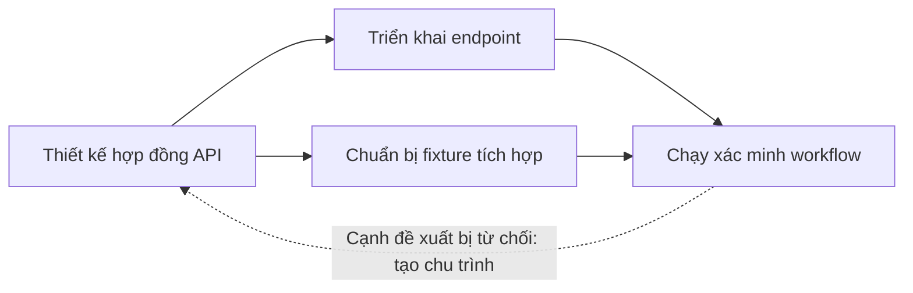
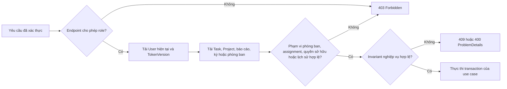
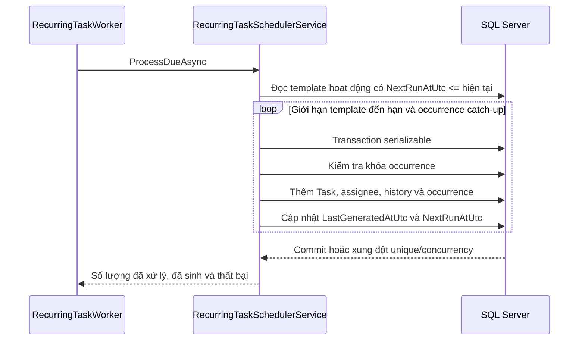
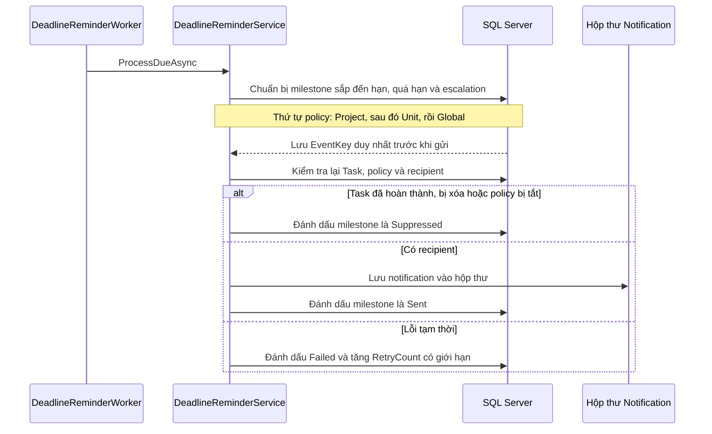
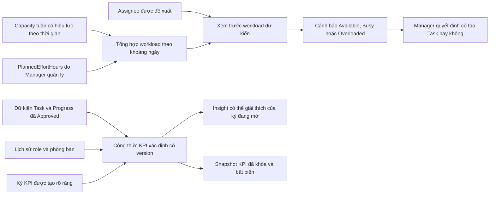

# Các workflow trong domain

Những sơ đồ này mô tả implementation hiện tại, không phải đề xuất redesign.

## Task, Progress và Review

Trạng thái Task do server suy ra. Báo cáo Progress có trạng thái review riêng; `Rejected` thuộc về báo cáo và đưa Task trở lại `InProgress`.

```mermaid
stateDiagram-v2
    [*] --> NotStarted: Trưởng phòng tạo và giao công việc
    NotStarted --> InProgress: Nhân viên báo cáo một phần tiến độ
    NotStarted --> Submitted: Nhân viên báo cáo 100%; cần duyệt
    NotStarted --> Approved: Nhân viên báo cáo 100%; không cần duyệt
    InProgress --> InProgress: Nhân viên báo cáo một phần tiến độ
    InProgress --> Submitted: Nhân viên báo cáo 100%; cần duyệt
    InProgress --> Approved: Nhân viên báo cáo 100%; không cần duyệt
    Submitted --> Approved: Trưởng phòng duyệt báo cáo
    Submitted --> InProgress: Trưởng phòng từ chối và nêu lý do
    Approved --> [*]
```

Chỉ được hoàn thành khi mọi dependency chặn đã được duyệt và mọi assignee bắt buộc đều có lần hoàn thành được chấp thuận. Task yêu cầu review bắt buộc phải có evidence khi báo cáo 100%. Ma trận chuyển trạng thái được triển khai bởi [TaskWorkflowPolicy](../Domain/Workflows/TaskWorkflowPolicy.cs), điều phối bởi [TaskWorkflowService](../Application/Services/TaskWorkflowService.cs) và mô tả trong [workflow Task](task-workflow.md).

## Đồ thị dependency của Task

Một cạnh hướng từ prerequisite đến công việc bị nó chặn. Ví dụ là directed acyclic graph (DAG):

`Triển khai endpoint` và `Chuẩn bị fixture tích hợp` tiếp tục bị chặn cho đến khi `Thiết kế hợp đồng API` được duyệt. `Chạy xác minh workflow` bị chặn đến khi cả hai công việc tiên quyết được duyệt. Thêm `D -> A` bị từ chối vì đã có một đường đi từ `A` đến `D`.

[TaskDependencyService](../Application/Services/TaskDependencyService.cs) phát hiện cycle trực tiếp và gián tiếp trước khi lưu. SQL Server là lớp bảo vệ cuối cùng cho self-reference và cạnh trùng. Hoàn thành hoặc xóa dependency đều ghi lịch sử Task để việc gỡ chặn hiển thị trên activity timeline.

## Authorization theo tài nguyên

Role authorization chỉ là lớp biên ngoài. Application service còn phải kiểm tra quyền trên tài nguyên cụ thể và phạm vi tổ chức hiện tại.

Ma trận authorization đầy đủ theo role/tài nguyên nằm trong [quy tắc nghiệp vụ](business-rules.md). Cụ thể, Admin cấu hình tổ chức nhưng không tạo Project hoặc giao công việc hằng ngày; Manager chỉ sở hữu việc thực thi trong phòng ban hiện tại; User chỉ thao tác trên tài nguyên Task được giao.

## Recurring Task bền vững

`(TemplateId, ScheduledForUtc)` là duy nhất. Database lưu lịch chạy tiếp theo và các occurrence đã sinh nên process restart không làm mất hoặc lặp công việc. Worker chỉ chịu trách nhiệm polling và metric; quy tắc scheduling nằm trong application service.

## Deadline reminder và escalation

`EventKey` và `(TaskId, Type)` ngăn milestone trùng. Trạng thái delivery tồn tại qua restart, còn Task đã hoàn thành hoặc bị xóa sẽ suppress delivery đang chờ. Không có in-memory queue nào là nguồn dữ liệu chuẩn.

## Workload, capacity và KPI

Workload planning và báo cáo KPI dùng dữ liệu Task liên quan cho hai mục đích khác nhau và không được trộn lẫn.

Workload dự kiến là cảnh báo lập kế hoạch không chặn thao tác. `PlannedEffortHours` không thay đổi điểm KPI. KPI dùng kết quả workflow đã duyệt, dữ kiện deadline/từ chối, ranh giới kỳ và phạm vi tổ chức trong lịch sử. Kết quả đã khóa lưu formula version, identity snapshot và raw metric để thay đổi Task hoặc nhân sự sau này không thể viết lại lịch sử.

Implementation và bằng chứng:

- [WorkloadService](../Application/Services/WorkloadService.cs) thực hiện tính workload theo tập hợp.
- [UserPerformanceService](../Application/Services/UserPerformanceService.cs) tính input hiệu suất cá nhân và Manager.
- [KpiFormula](../Application/Common/KpiFormula.cs) sở hữu formula version và hằng số điểm xác định.
- [bằng chứng hiệu năng query](performance.md) ghi lại số SQL command bị giới hạn.
