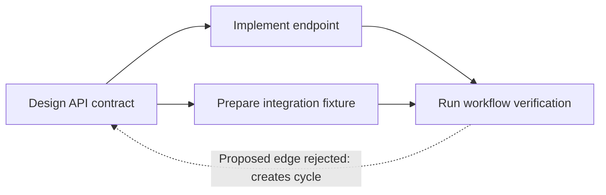
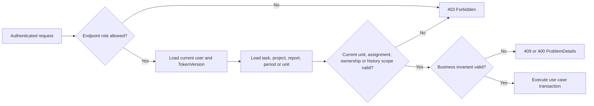
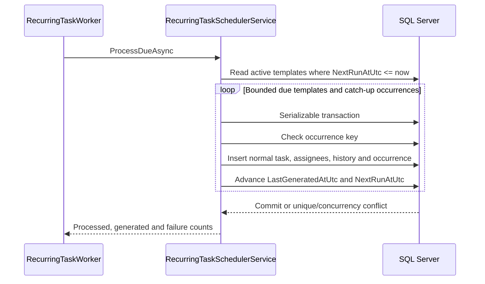
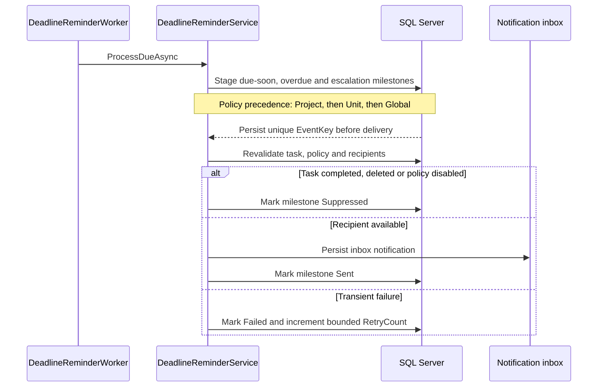
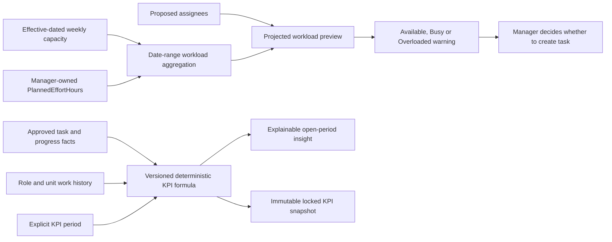

# Domain Workflows

These diagrams describe the current implementation. They are not a proposed redesign.

## Task, Progress And Review

Task state is server-derived. A progress report has its own review state; `Rejected` belongs to the report and returns the task to `InProgress`.

```mermaid
stateDiagram-v2
    [*] --> NotStarted: Manager creates and assigns task
    NotStarted --> InProgress: User reports partial progress
    NotStarted --> Submitted: User reports 100%; review required
    NotStarted --> Approved: User reports 100%; no review required
    InProgress --> InProgress: User reports partial progress
    InProgress --> Submitted: User reports 100%; review required
    InProgress --> Approved: User reports 100%; no review required
    Submitted --> Approved: Manager approves report
    Submitted --> InProgress: Manager rejects report with reason
    Approved --> [*]
```

Completion is allowed only when all blocking dependencies are approved and every required assignee has an accepted completion. Evidence is mandatory for a 100 percent report when the task requires review. The transition matrix is implemented by [TaskWorkflowPolicy](../Domain/Workflows/TaskWorkflowPolicy.cs), orchestrated by [TaskWorkflowService](../Application/Services/TaskWorkflowService.cs), and documented in [task workflow](task-workflow.md).

## Task Dependency Graph

An edge points from a prerequisite to the work it blocks. The example is a directed acyclic graph (DAG):

`Implement endpoint` and `Prepare integration fixture` remain blocked until `Design API contract` is approved. `Run workflow verification` remains blocked until both predecessors are approved. Adding `D -> A` is rejected because a path already exists from `A` to `D`.

[TaskDependencyService](../Application/Services/TaskDependencyService.cs) detects direct and indirect cycles before persistence. SQL Server remains the final guard for self-reference and duplicate edges. Dependency completion and removal write task history so an unblock is visible in the activity timeline.

## Resource Authorization

Role authorization is only the outer boundary. Application services must also authorize the concrete resource and current organizational scope.

The complete role/resource authorization matrix is in [business rules](business-rules.md). In particular, Admin configures the organization but does not create projects or assign daily work; Manager owns work execution only inside the current department; User acts only on assigned task resources.

## Durable Recurring Tasks

`(TemplateId, ScheduledForUtc)` is unique. The database stores the next schedule and generated occurrences, so process restarts do not lose or repeat work. The worker owns polling and metrics only; scheduling rules remain in the application service.

## Deadline Reminder And Escalation

`EventKey` and `(TaskId, Type)` prevent duplicate milestones. Delivery state survives restart, and a completed or deleted task suppresses pending delivery. No in-memory queue is the source of truth.

## Workload, Capacity And KPI

Workload planning and KPI reporting use related task data for different purposes and must not be conflated.

Projected workload is a non-blocking planning warning. `PlannedEffortHours` does not change KPI score. KPI uses approved workflow outcomes, deadline/rejection facts, period boundaries and historical organizational scope. Locked results store formula version, identity snapshots and raw metrics so later task or staff changes cannot rewrite history.

Implementation and evidence:

- [WorkloadService](../Application/Services/WorkloadService.cs) performs set-based workload calculations.
- [UserPerformanceService](../Application/Services/UserPerformanceService.cs) calculates personal and manager performance inputs.
- [KpiFormula](../Application/Common/KpiFormula.cs) owns formula version and deterministic score constants.
- [query performance evidence](performance.md) records bounded SQL command counts.
